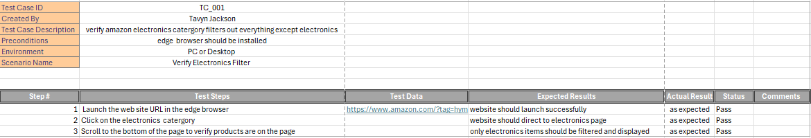
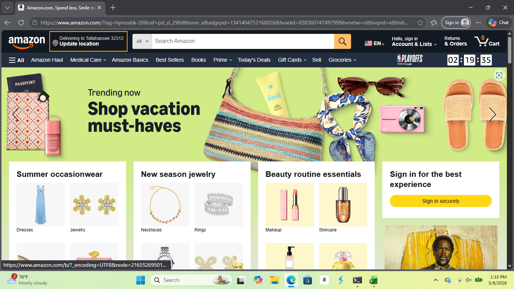
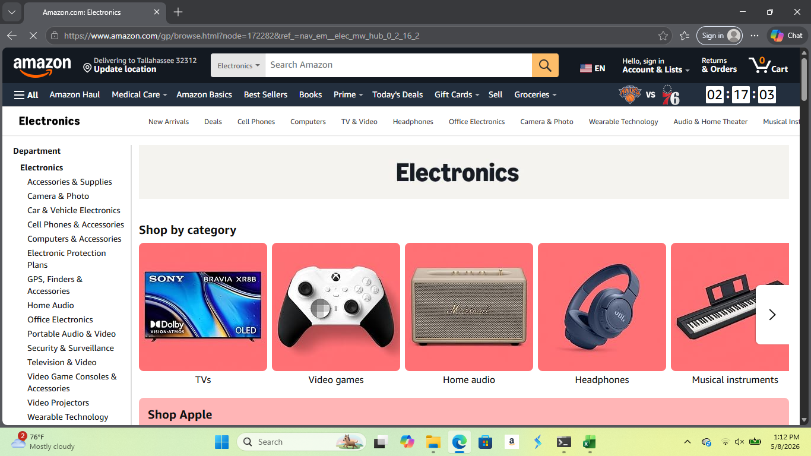

<h1>Amazon Test Case</h1>

<h2>Description</h2>
This project focuses on manual testing of the Amazon Electronics section to ensure category accuracy and proper product filtering. The test cases are designed to verify that only electronics-related products are displayed, while unrelated items such as furniture or other non-electronic products are excluded. The project includes detailed test scenarios, test steps, expected results, and validation criteria to support quality assurance and improve user experience.

 

<h2>Purpose:</h2>
The purpose of this test case is to verify that the Amazon Electronics section displays only electronics-related products and correctly filters out unrelated items such as furniture or products from other categories. This helps ensure accurate product categorization, improves the user experience, and validates that the website’s filtering and navigation functionality works as expected.

 
<h2>Resources Used:</h2>
- <b>Browser: Chrome, Edge, or Firefox </b>
 
- <b>URL: www.amazon.com</b>
 
 
<h2>Test Case File:</h2>

 

<h2>Test Execution:</h2>
 
- <b>Open the preferred web browser ( Chrome, Edge, or Firefox )</b>
 
- <b>Type in www.amazon.com in the browser URL header</b>
 
- <b>Select "All" icon list</b>
 
- <b>Scroll down to shop by department and select electronics</b>
 
 

 
- <b>Will be redirected to the electronics page</b>
 
 

 
 
- <b>Search through page to confirm there is no other product other than electronics</b>
 

